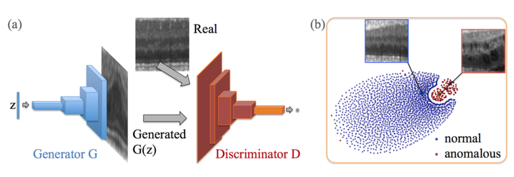
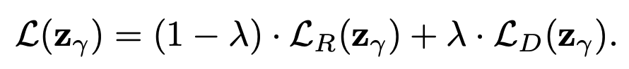
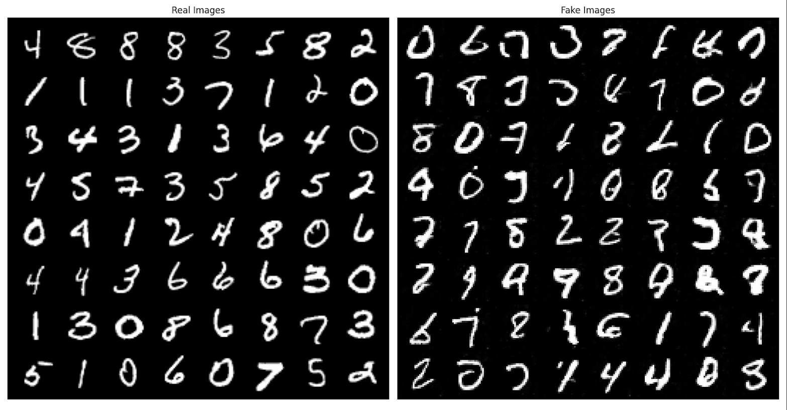
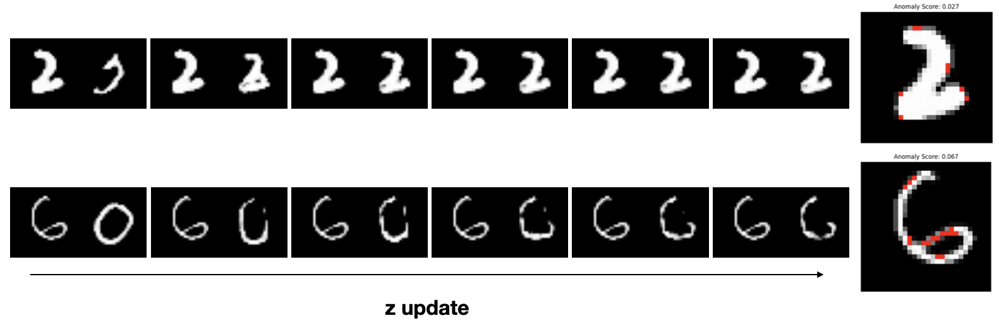

# AnoGAN
This is unofficial implementation of AnoGAN in pytorch


### Requirements
* Ubuntu 18.04
* Python 3.7
* Pytorch 1.8.1

# How to Train
1. Set parameters in train.py
2. Set gpu(cuda) option in train.py
```python
$ python3 train.py
```

# Inference
1. create random z vector in latent space
2. update z vector using loss below


### How to Inference
1. Set checkpoint paths in test.py
2. Set gpu(cuda) option in test.py
```python
$ python3 test.py
```

# Results
### Generated MNIST Image


### Inferenced Abnormal Image
* The left image is input image, right image is generated image from z
* `2` is trained. Anomaly Score: 0.027
* `6` is not trained. Anomaly Score: 0.067
 

# Reference
[1] paper: https://arxiv.org/abs/1703.05921